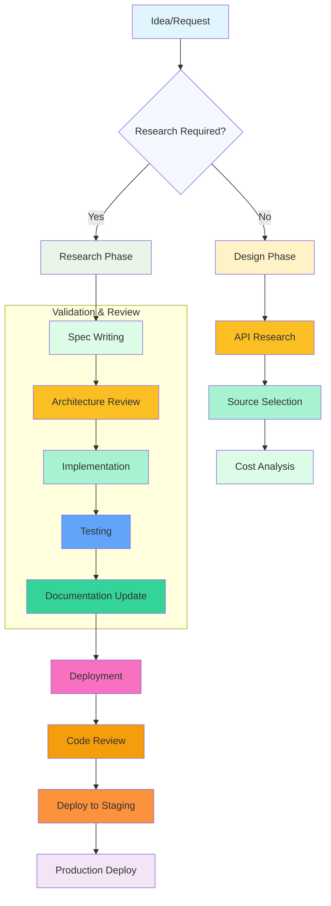
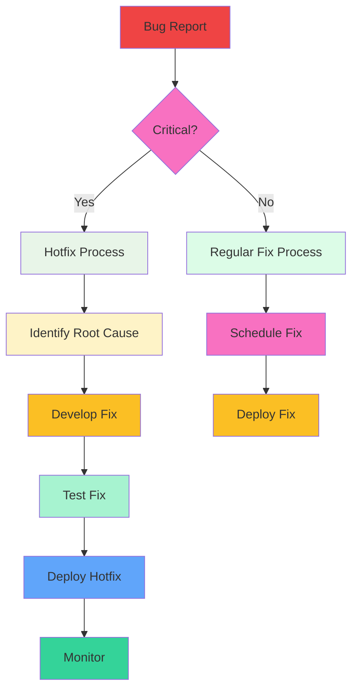
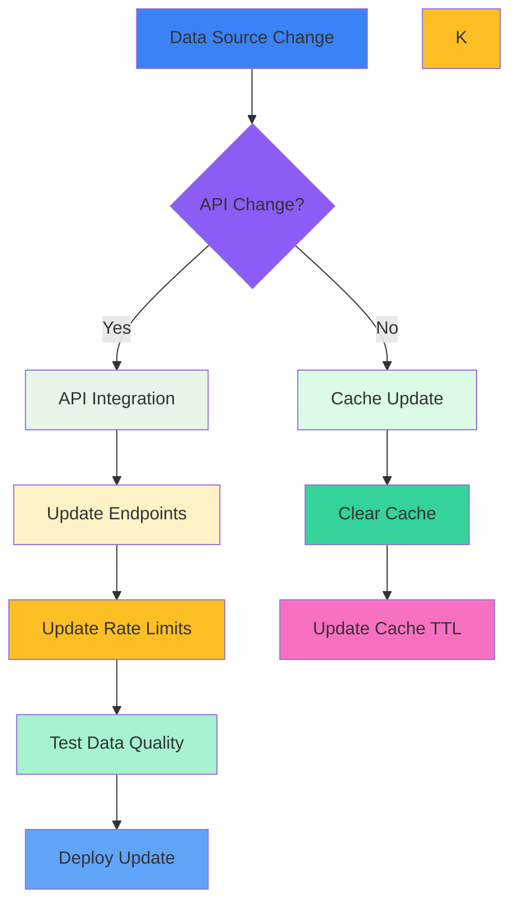
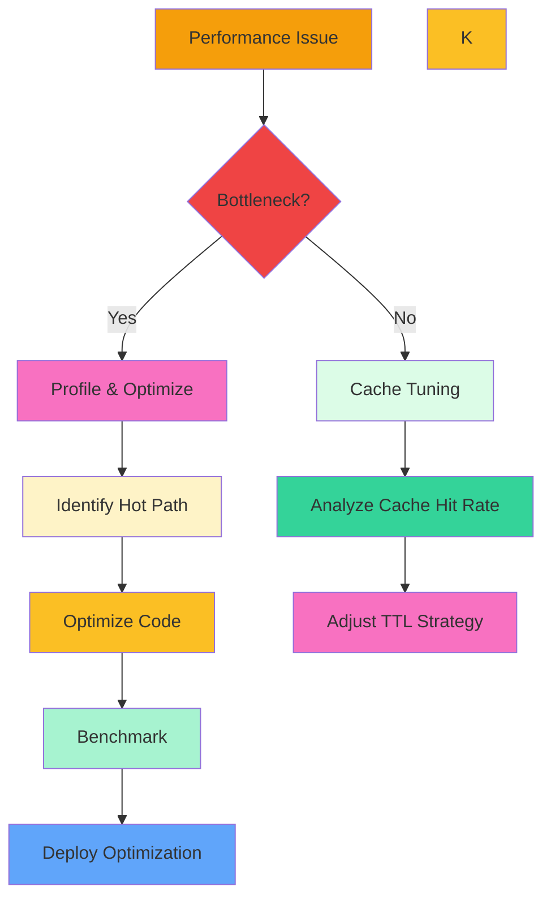
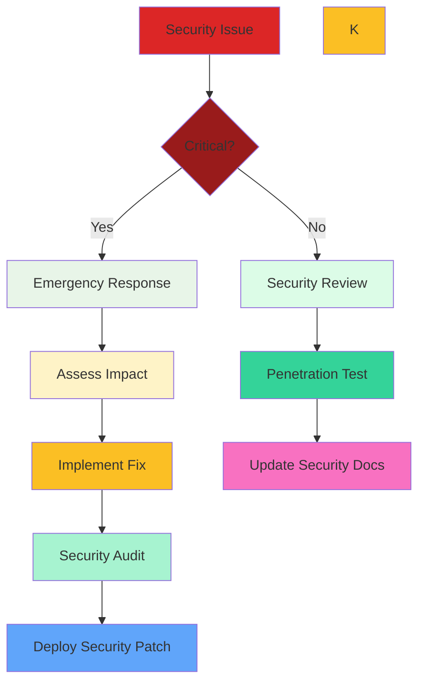
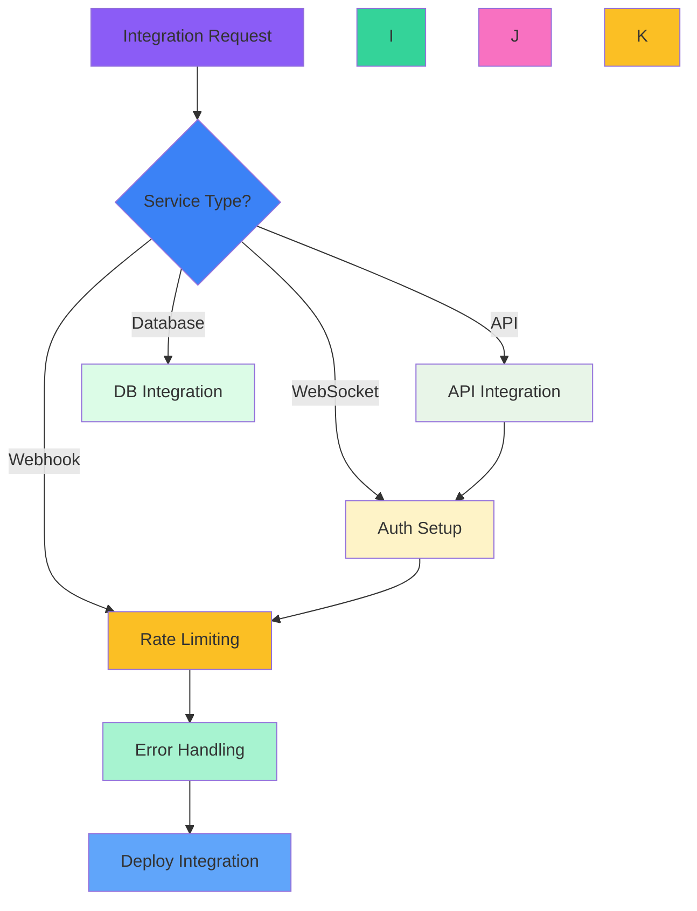

# 🚀 OpenJoey V1 Build & Update Flowchart

## 📋 QUICK DECISION MATRIX

| Situation       | Action                     | Priority | Impact           |
| --------------- | -------------------------- | -------- | ---------------- |
| **New Feature** | 🆕 Follow Build Flow       | High     | New capabilities |
| **Bug Fix**     | 🐛 Follow Fix Flow         | Critical | System stability |
| **Data Update** | 📊 Follow Update Flow      | Medium   | Data accuracy    |
| **Performance** | ⚡ Follow Optimize Flow    | Medium   | User experience  |
| **Security**    | 🔒 Follow Security Flow    | Critical | Trust & safety   |
| **Integration** | 🔗 Follow Integration Flow | High     | New connections  |

---

# 🆕 NEW FEATURE BUILD FLOW

---

# 🐛 BUG FIX FLOW

---

# 📊 DATA UPDATE FLOW

---

# ⚡ PERFORMANCE OPTIMIZE FLOW

---

# 🔒 SECURITY FLOW

---

# 🔗 INTEGRATION FLOW

---

# 📋 BUILD CHECKLISTS

## ✅ Pre-Build

- [ ] Feature requirements documented
- [ ] Architecture reviewed
- [ ] Dependencies identified
- [ ] Environment prepared

## ✅ During Build

- [ ] Code follows existing patterns
- [ ] TypeScript errors resolved
- [ ] Tests written and passing
- [ ] Documentation updated

## ✅ Pre-Deploy

- [ ] Code reviewed by team
- [ ] Security audit completed
- [ ] Performance benchmarks met
- [ ] Integration tested

## ✅ Post-Deploy

- [ ] Monitoring configured
- [ ] Error tracking active
- [ ] User feedback collected
- [ ] Performance metrics analyzed

---

# 🎯 CURRENT V1 STATUS (70%+ COMPLETE)

## ✅ **CORE SYSTEMS** (DEPLOYED & RUNNING)

- [x] Telegram bot integration
- [x] Supabase database (27 tables)
- [x] 8 V1 services deployed
- [x] Hetzner infrastructure
- [x] Basic conversation engine

## 🔄 **IN PROGRESS** (BEING ENHANCED)

- [ ] Multi-chain price service (designed, ready for deploy)
- [ ] Intelligence packaging (documented)
- [ ] Risk-aware responses (partially implemented)
- [ ] Premium formatting templates (documented)

## ❌ **MISSING/NEEDS WORK** (GAPS TO CLOSE)

- [ ] Real API integration (deploy price service)
- [ ] Remove mock Math.random() data
- [ ] Chain-aware conversation responses
- [ ] Volume spike detection (real-time)
- [ ] Portfolio risk analysis (real data)
- [ ] Trending lists (real-time)
- [ ] Caching implementation (Redis/Supabase)
- [ ] Rate limiting (production)
- [ ] Error handling (graceful degradation)

---

# 🚀 NEXT IMMEDIATE ACTIONS

1. **HIGH PRIORITY**: Deploy multi-chain price service
2. **MEDIUM PRIORITY**: Update services to use real data
3. **LOW PRIORITY**: Remove mock data from existing services
4. **ONGOING**: Test chain detection and risk analysis

---

# 📈 SUCCESS METRICS TO TRACK

## Technical Metrics

- API response time < 3 seconds
- Cache hit rate > 90%
- Error rate < 1%
- Uptime > 99.9%

## User Experience Metrics

- Telegram response satisfaction > 4.5/5
- Daily active users > 100
- Premium conversion rate > 15%

## Business Metrics

- Monthly recurring revenue > €2,000
- Customer acquisition cost < €10
- User retention rate > 80%

---

**This flowchart provides the complete decision matrix for building and maintaining OpenJoey V1!** 🎯
