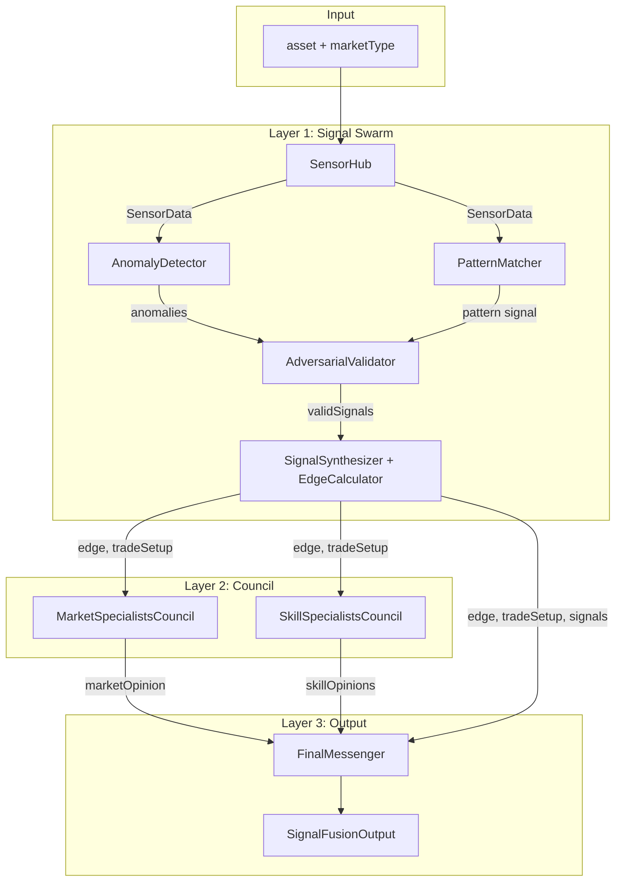

# Signal-Fusion — Data Process Flow

This document describes how Signal-Fusion processes data from raw inputs to the final user-facing output.

---

## High-Level Pipeline

```
  USER REQUEST (asset + market type)
           │
           ▼
  ┌────────────────────────────────────────────────────────────────────────┐
  │  LAYER 1: SIGNAL SWARM (Quantified Edge Engine)                         │
  │  ┌──────────────┐  ┌──────────────┐  ┌──────────────┐  ┌──────────────┐  │
  │  │   SENSORS    │→ │  PROCESSORS  │→ │  ADVERSARIAL │→ │  SYNTHESIS   │  │
  │  │  (ingest)    │  │  (detect)    │  │  (validate)  │  │  (edge +     │  │
  │  │              │  │              │  │              │  │   trade)     │  │
  │  └──────────────┘  └──────────────┘  └──────────────┘  └──────────────┘  │
  └────────────────────────────────────────────────────────────────────────┘
           │
           │  SensorData, Signals[], EdgeCalculation, TradeSetup
           ▼
  ┌────────────────────────────────────────────────────────────────────────┐
  │  LAYER 2: TRADING COUNCIL (Interpretation)                              │
  │  ┌─────────────────────┐  ┌─────────────────────┐                      │
  │  │ Market Specialists   │  │ Skill Specialists   │                      │
  │  │ (Crypto/Stock/etc.)  │  │ (Chart/Whale/Risk)  │                      │
  │  └──────────┬──────────┘  └──────────┬──────────┘                      │
  │             └────────────┬────────────┘                                  │
  │                          ▼                                               │
  │                   CouncilOpinion[]                                       │
  └────────────────────────────────────────────────────────────────────────┘
           │
           ▼
  ┌────────────────────────────────────────────────────────────────────────┐
  │  LAYER 3: FINAL MESSENGER                                               │
  │  Consensus + Verdict + Formatted output (CLI / Telegram / Discord)      │
  └────────────────────────────────────────────────────────────────────────┘
           │
           ▼
  SignalFusionOutput (and optional TradeLedger + EdgeDecayTracker)
```

---

## Step-by-Step Process

### Step 1 — Data Ingestion (Sensors)

**Component:** `SensorHub` → `PriceFeedSensor`, `OnChainSensor`, `SocialSensor`, `MacroSensor`, `NewsSensor`

**Input:** `asset` (e.g. `"SOL"`), `marketType` (`crypto` | `stock` | `forex` | `commodity` | `penny`)

**Process:**

- All sensor tasks are run **in parallel** via `Promise.allSettled`.
- **Always:** Price data (PriceFeedSensor) — source depends on market (DexScreener, CoinGecko, Birdeye for crypto; Yahoo/Finviz for stocks; etc.).
- **Crypto only:** On-chain data (holders, concentration) + whale activity (net flow, large txs).
- **All markets:** Social sentiment (SocialSensor) + news (NewsSensor).
- **Non-crypto:** Macro data (MacroSensor): DXY, VIX, Fed policy, risk-on/off.

**Output:** Single `SensorData` object containing (as available):

- `price` — PriceData (price, volume24h, change24h, marketCap, liquidity, source)
- `onchain` — OnChainData (holders, concentration, liquidity locked, etc.)
- `whale` — WhaleData (netFlow24h, accumulationScore, largeTransactions)
- `social` — SocialData (sentimentScore, volume24h, trending, mentions)
- `news` — NewsData (articles, breakingNews, catalystDetected)
- `macro` — MacroData (dxy, vix, fedPolicy, riskOnOff)

---

### Step 2 — Signal Detection (Processors)

**Components:** `AnomalyDetector`, `PatternMatcher`

**Input:** `SensorData` from Step 1

**Process:**

1. **AnomalyDetector** produces raw **Signals** from anomalies:
   - **Volume anomaly** — volume24h > threshold → volume_anomaly signal
   - **Price anomaly** — |change24h| > threshold → price_action signal (bullish/bearish)
   - **Whale anomaly** — large txs above threshold → whale_movement signal
   - **Sentiment anomaly** — |sentimentScore| > 0.5 → social_sentiment signal

2. **PatternMatcher** evaluates `SensorData` against **built-in patterns** (e.g. “Breakout with Volume”, “Whale Accumulation”, “Sentiment Reversal”, “Macro Correlation”, “Penny Catalyst”):
   - Each pattern has conditions (e.g. `price.change24h > 5`, `whale.netFlow24h > 50000`).
   - For each pattern, conditions are evaluated; match score = (matched weight / total weight).
   - Matches with score > 0.3 are kept and sorted by score.
   - Top pattern (if any) is converted to a **pattern_match** Signal via `patternToSignal()`.

3. **Combined signals:** `allSignals = [ ...anomalies, topPatternSignal ]` (if top pattern exists).

**Output:** List of **Signals** (each with id, asset, type, direction, confidence, strength, data, metadata). Not yet validated.

---

### Step 3 — Adversarial Validation

**Component:** `AdversarialValidator`

**Input:** `allSignals`, `SensorData`

**Process:**

- For each signal, run a fixed set of **adversarial tests** (e.g. bull-trap, whale-manipulation, sentiment-peak, liquidity, correlation-break, late-entry, rug-pull, news-lag).
- Each test is a function `(signal, data) => boolean`; failure can be **critical** or **warning**.
- If any **critical** test fails, the signal is rejected.
- Validation result (pass/fail + test list) is stored on `signal.metadata.validated` and `signal.metadata.adversarialTests`.

**Output:** `{ validSignals, invalidSignals, summary }`. Only `validSignals` proceed.

---

### Step 4 — Synthesis (Edge + Trade Setup)

**Components:** `SignalSynthesizer` → `EdgeCalculator`

**Input:** `asset`, `marketType`, `sensorData`, `validSignals`, `topPatternMatch` (optional)

**Process:**

1. **Edge calculation** (EdgeCalculator):
   - **Base win rate** from signals (weighted by confidence × strength; bullish vs bearish).
   - **Bayesian update** using pattern match (if present): P(Win|Pattern) from historical wins/losses of that pattern.
   - **Risk/reward** from market-type defaults (crypto/stock/forex/commodity/penny) and signal strength.
   - **Expected value** = (winRate × avgWin) − (lossRate × avgLoss).
   - **Conviction score** (0–10) from signal diversity, pattern match, and EV.
   - **Half-life** (hours) from market type and signal types (e.g. social decays faster).

2. **Trade construction** (EdgeCalculator.constructTrade):
   - **Direction:** long if EV > 0, else short.
   - **Entry zone:** around current price (spread); urgency from conviction.
   - **Stop loss:** from avgLoss %.
   - **Targets:** multiple (e.g. 2:1, 4:1, 6:1 R/R) with probabilities and actions.
   - **Position sizing:** Kelly (half-Kelly, capped); portfolio %, max risk %.
   - **Scenarios:** bull/base/bear with probabilities and catalysts.
   - **Warnings:** e.g. low win rate, low EV, high volatility, fast decay.

**Output:** `EdgeCalculation` (winRate, expectedValue, convictionScore, halfLife, etc.) and `TradeSetup` (entry, stop, targets, position, scenarios, warnings).

---

### Step 5 — Trading Council (Interpretation)

**Components:** `MarketSpecialistsCouncil`, `SkillSpecialistsCouncil`

**Input:** `sensorData`, `edge`, `tradeSetup`; plus market type for choosing specialist.

**Process:**

1. **Market specialist** (e.g. Crypto Sage, Solana Scout, Stock Sentinel): one opinion based on market type.
2. **Skill specialists** (Chart Whisperer, Sentiment Sleuth, Whale Tracker, News Hound, Risk Advisor, Safety Inspector, etc.): each produces an opinion from the same inputs.

**Output:** `marketOpinion` (optional), `skillOpinions[]` — each a **CouncilOpinion** (stance, confidence, reasoning, keyPoints, concerns).

---

### Step 6 — Final Messenger

**Component:** `FinalMessenger`

**Input:** query, asset, marketType, edge, tradeSetup, signals, marketOpinion, skillOpinions, processingTime

**Process:**

- **Consensus:** Aggregate council opinions into a single consensus score and majority/minority stance.
- **Verdict:** Final recommendation (`buy` | `sell` | `hold` | `avoid`), conviction, urgency, summary, key risks, key opportunities.
- **Structure:** Build full `SignalFusionOutput` (signalSwarm, tradingCouncil, finalVerdict, metadata).
- **Format:** Optionally format for channel (CLI, Telegram, Discord, Slack).

**Output:** `SignalFusionOutput` — the single object returned to the user/agent.

---

### Step 7 — Side Effects (Optional)

- **TradeLedger:** Record the top valid signal + trade setup + edge (for stats/history).
- **EdgeDecayTracker:** Register signal + edge for half-life/decay reporting (e.g. `decay` CLI command).

---

## Data Types Summary

| Stage   | Key types                       | Description                                     |
| ------- | ------------------------------- | ----------------------------------------------- |
| After 1 | `SensorData`                    | Raw price, on-chain, whale, social, news, macro |
| After 2 | `Signal[]`                      | Anomaly + pattern signals                       |
| After 3 | `Signal[]` (filtered)           | Only validated signals                          |
| After 4 | `EdgeCalculation`, `TradeSetup` | Quantified edge and concrete trade plan         |
| After 5 | `CouncilOpinion[]`              | Market + skill specialist views                 |
| After 6 | `SignalFusionOutput`            | Full response for the user                      |

---

## Flow Diagram (Mermaid)



---

## File → Responsibility

| Path                                     | Role in process                                                                                           |
| ---------------------------------------- | --------------------------------------------------------------------------------------------------------- |
| `src/sensors/SensorHub.ts`               | Orchestrates parallel sensor fetch; builds `SensorData`.                                                  |
| `src/sensors/PriceFeedSensor.ts`         | Price/volume/change (crypto: DexScreener/CoinGecko/Birdeye; stocks/forex/commodity/penny: other sources). |
| `src/sensors/OnChainSensor.ts`           | On-chain + whale data (e.g. Solana).                                                                      |
| `src/sensors/SocialSensor.ts`            | Social sentiment.                                                                                         |
| `src/sensors/MacroSensor.ts`             | Macro (DXY, VIX, Fed, risk-on/off).                                                                       |
| `src/sensors/NewsSensor.ts`              | News + catalysts.                                                                                         |
| `src/processors/AnomalyDetector.ts`      | Turns sensor data into anomaly signals.                                                                   |
| `src/processors/PatternMatcher.ts`       | Matches patterns; converts top match to signal.                                                           |
| `src/processors/AdversarialValidator.ts` | Validates signals; filters to valid only.                                                                 |
| `src/processors/EdgeCalculator.ts`       | Edge math + trade construction.                                                                           |
| `src/synthesis/SignalSynthesizer.ts`     | Calls EdgeCalculator; builds edge + tradeSetup + summary.                                                 |
| `src/synthesis/TradeLedger.ts`           | Records signals/trades for stats.                                                                         |
| `src/synthesis/EdgeDecayTracker.ts`      | Tracks edge decay over time.                                                                              |
| `src/council/MarketSpecialists.ts`       | Market-specific opinion.                                                                                  |
| `src/council/SkillSpecialists.ts`        | Skill-specific opinions.                                                                                  |
| `src/council/FinalMessenger.ts`          | Consensus + verdict + `SignalFusionOutput`.                                                               |
| `src/index.ts`                           | `SignalFusion.analyze()` runs steps 1–7 in order.                                                         |
| `src/cli.ts`                             | CLI commands that call the same pipeline (analyze, quick, compare, status, etc.).                         |

This is the end-to-end process Signal-Fusion uses to process data from a user request to the final output.
